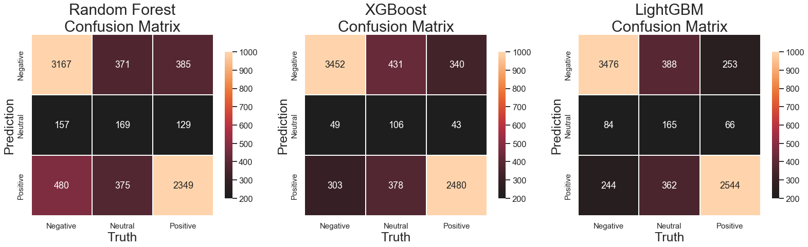

# Reviews Classification System With NLP

    

## Overview
Main goal of this project is to create a model that will be able to classify customers reviews using machine learning multi classification algorithms.
Random Forest, XGBoost, LightGbm algorithms used to create baseline models. The final model was a XGBoost that used TfidfVectorizer for feature engineering. It produced an F1 of 0.8 and Accuracy of 0.82.

## Business Problem
   
The data that revolves around business increases everyday with more transactions and reviews. Since ratings and reviews are based on the subjective experiences of normal people there is often going to be a lot of nuance that a simple numerical rating will miss when people leave a review.  It is very simple for a person to leave an average / good rating for a café, but when exploring the actual reviews we can have Natural Language Processing and Machine Learning Algorithms return a "true" result that uses the depth of their words to formulate how best a business should be classified. In this project based on data from Yelp I have broken the customer feedback into 'Negative', 'Neutral', and 'Positive' after being put through my project, to better, and more immediately, reflect the way the reviewers can understand the business.   
 

## Approach

General Approach for this problem was based on Cross Industry Standard Process for Data Mining (CRISP-DM)
Which includes all following impotrtant steps: 

1. Look at the big picture. 
2. Get the data. 
3. Discover and visualize the data to gain insights. 
4. Prepare the data for Machine Learning algorithms. 
5. Select a model and train it. 
6. Fine-tune your model. 
7. Present your solution. 
8. Launch, monitor, and maintain system.

    
    
## Methodology

Based on our business problem we are trying to accomplish certain tasks that involve natural language. NLP allows computers to interact with text data in a structured and sensible way. With NLP, computers are taught to understand human language, its meaning and sentiments. In order to translate complex natural human language into systematically constructed features we need to follow some major steps which are shown on the next graph.

    

## Analysis

Data for this project was sourced from yelp.com. With API requests library successfully collected information about more than 1600 cafes and bakeries in New York City. More than 41 000 business reviews successfully web scraped and loaded into the main Database.

Each review on yelp source labeled with a rating provided by the customer.  For this project reviews classified with rating 1 and 2 were labeled as 'Negative' class, 4 and 5 labeled as 'Positive' and reviews with class 3 labeled as 'Neutral'. Graph below on the left explains original scraped data from the web with 5 classes. Right side graph shows labeled data for this project based on original information about reviews.

    

With appropriate functions from Pandas library some insides were found from the data. Graph below shows the average length of review per each class. 'Negative' reviews on average tend to have more words then 'Positive'. This could be important variable for features engineering.

    

After appropriate Pre-Processing that includes Tokenization, Removing Stop-words and Cleaning Data next step was to generate frequency distribution of words within the whole corpus. It helped to understand data better and explained to us what kind of additional cleaning needs to be done before turning data into a Document-Term Matrix. Graph below shows the 20 most frequent 3-gram words that were found in each class.

    

All classes contain lots of the same words. Because of the similarities of each label’s vocabulary, it could be difficult for machine learning algorithms to differentiate between them and determine target variable. Graph below represents a venn diagram that shows how many unigram and 3 -gram words belong to each class and how many words show up in both classes. It helps to understand that unigram and 3 -gram  must be important variables during features engineering.

    

## Modeling

Weighted F1 score and Accuracy was used as main evaluation metrics for this project. Starting with baseline models, Random Forest, XGBoost , LightGBM was applied to processed data. Best result was shown by XGBoost and LightGBM Model with Weighted F1-score = 88 and Accuracy - 81%
Next step was to run Gridsearch on the same 3 models. Following table shows the performance of each model with best hyperparameters found by Gridsearch.

    
 
Based on results, the highest Accuracy and weighted F-1 score achieved with LightGbm classifier with litter overfitting.
Testing Accuracy: 0.89 and weighted F1 Score: 0.79.
The Confusion Matrix below shows that model able to separate well Negative and Posetive classes but struggle and doesn't predict so well Neutral class.
This could be explained with a big overlap in unigrams (single words) and bigrams (pairs of words) between Neutral class and Positieve/Negatieve classes.

    

## Conclusion

Business problem was solved with NLP that allows computers to interact with text data in a structured and sensible way. Three different Machine Learning models were applied to processed data. The best results shown by LightGBM model with Accuracy 0.89 and F-1 score 0.79. Final model distinguishes Positive and Negative classes but struggles to predict Neutral class.            

## Future Work

To further develop this project here are some immediate next steps that could be executed.
- Collect more data labeled as 'Neutral' to balance classes.
- Apply additional preprocessing steps to remove specific unigram words in the main corpus.
- Evaluate the model with new reviews to see if it can generalize well.
- Apply sequential based models for text classification, such as LSTM and RNN.

## Repository Structure

    ├── README.md                    # The top-level README for reviewers of this project"
    ├── data                         # Data Base with scraped data. CSV tables with processed data.
    ├── images                       # Both sourced externally and generated from Code"       
    └── pickles                      # Results of Grid Search for each model   
    └── modules                      # notebooks and files with main functions
        |─-data_collection.ipynb
        |──data_processing.ipynb
        |──eda.ipynb
        |──modeling.ipynb
        └──utils.py
    

**Contact Information:**  
[Ivan Zakharchuk](https://github.com/vanitoz) 

